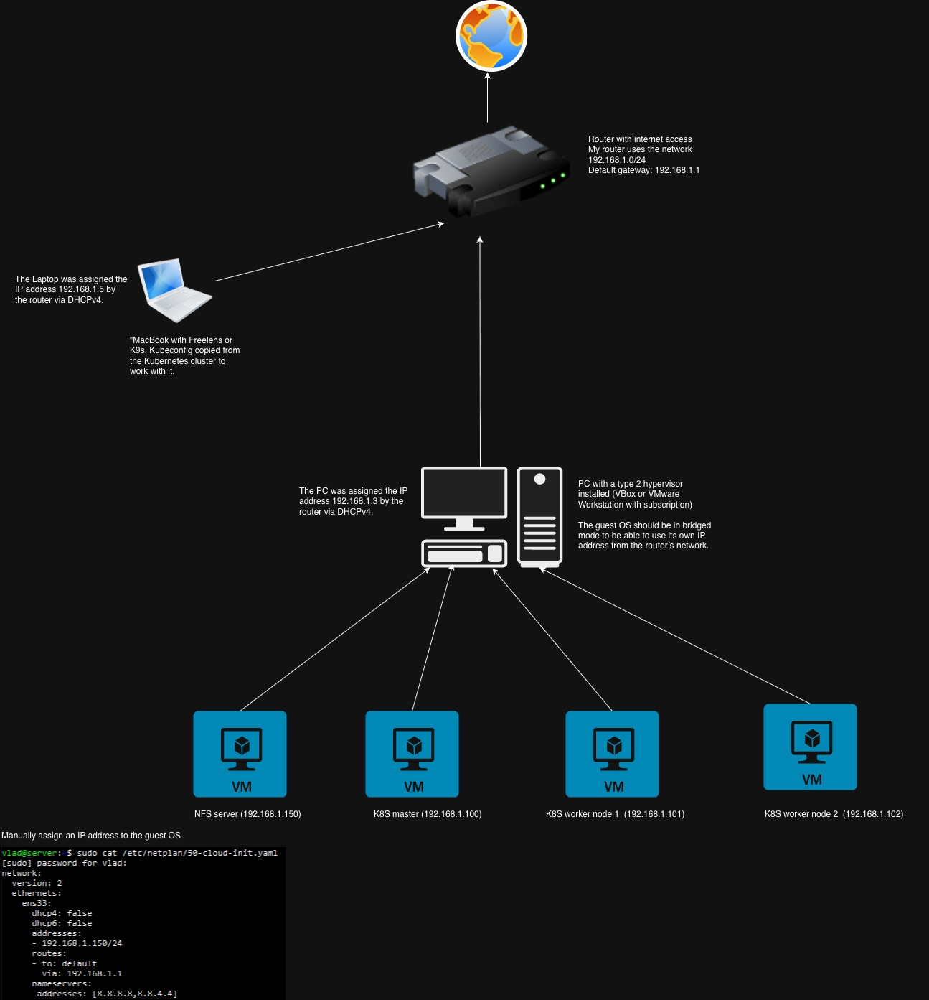

# On-prem K8S

## 🧭 Overview
This project provides a simple **on-premises Kubernetes (K8S)** setup that can be launched locally on a personal computer.  
The deployment includes a complete local Kubernetes cluster with:
- **1 Master Node**
- **2 Worker Nodes**
- **NFS Server** for shared storage

This setup is ideal for testing, learning, and developing Kubernetes workloads without relying on a cloud provider.

---

## ⚙️ Components
| Component     | Description |
|----------------|-------------|
| **Master Node** | Controls the cluster, manages API server, scheduler, and controller manager. |
| **Worker Nodes** | Run application workloads and connect to the master node. |
| **NFS Server** | Provides shared persistent storage for deployments. |

---

## 🚀 Deployment Plan

### 1. Prepare control environment (MacOS)
Install required tools:

- **Freelens** ([GitHub](https://github.com/freelensapp/freelens))
```bash
brew install --cask freelens
```
- Helm ([Helm](https://helm.sh/docs/intro/install/))
```bash
brew install helm
```
- Kubectl ([kubectl](https://kubernetes.io/docs/tasks/tools/install-kubectl-macos/))
```bash
brew install kubectl
```
2. **Prepare host environment for VM**
Use Ubuntu or Windows with installed VirtualBox. Launch VM with Ubuntu 24, network in bridged mode.

3. **Configure the Kubernetes Master and Worked Nodes**
- Configure static IP
```bash
nano /etc/netplan/50-cloud-init.yaml
```
```YAML
network:
  version: 2
  ethernets:
    enp0s3:
      dhcp4: false
      dhcp6: false
      addresses:
      - 192.168.1.100/24
      routes:
      - to: default
        via: 192.168.1.1
      nameservers:
        addresses: [8.8.8.8, 8.8.4.4]
```
```bash
netplan apply
```
- Install container runtime ([Link](https://kubernetes.io/docs/setup/production-environment/container-runtimes/))
Enable IPv4 packet forwarding
```bash
cat <<EOF | sudo tee /etc/sysctl.d/k8s.conf
net.ipv4.ip_forward = 1
EOF
sysctl --system
```
Verify that net.ipv4.ip_forward is set to 1 with
```bash
sysctl net.ipv4.ip_forward
```
Check abd switch off SWAP. Comment a line with /swap.img in */etc/fstab*
```bash
swapoff -a
```
Install containerd ([Link](https://github.com/containerd/containerd/blob/main/docs/getting-started.md)). ***Check versions!!!***
Install runc
```bash
wget https://github.com/opencontainers/runc/releases/download/v1.3.2/runc.amd64
install -m 755 runc.amd64 /usr/local/sbin/runc
```
Install CNI plugin
```bash
wget https://github.com/containernetworking/plugins/releases/download/v1.8.0/cni-plugins-linux-amd64-v1.8.0.tgz
mkdir -p /opt/cni/bin
tar Cxzvf /opt/cni/bin cni-plugins-linux-amd64-v1.8.0.tgz
```
Install and configure containerd
```bash
wget https://github.com/containerd/containerd/releases/download/v2.1.4/containerd-2.1.4-linux-amd64.tar.gz
tar Cxzvf /usr/local containerd-2.1.4-linux-amd64.tar.gz
mkdir /etc/containerd
containerd config default | tee /etc/containerd/config.toml
#Add to the /etc/containerd/config.toml
  [plugins."io.containerd.grpc.v1.cri".containerd.runtimes.runc.options]
    SystemdCgroup = true
#aAfter
  [plugins.'io.containerd.grpc.v1.cri'.x509_key_pair_streaming]
    tls_cert_file = ''
    tls_key_file = ''
curl -L https://raw.githubusercontent.com/containerd/containerd/main/containerd.service -o /etc/systemd/system/containerd.service
systemctl daemon-reload
systemctl enable --now containerd
systemctl status containerd
```
Install kubelet kubeadm kubectl ([Link](https://kubernetes.io/docs/setup/production-environment/tools/kubeadm/install-kubeadm/)
```bash
apt-get update
apt-get install -y apt-transport-https ca-certificates curl gpg
curl -fsSL https://pkgs.k8s.io/core:/stable:/v1.34/deb/Release.key | sudo gpg --dearmor -o /etc/apt/keyrings/kubernetes-apt-keyring.gpg
echo 'deb [signed-by=/etc/apt/keyrings/kubernetes-apt-keyring.gpg] https://pkgs.k8s.io/core:/stable:/v1.34/deb/ /' | sudo tee /etc/apt/sources.list.d/kubernetes.list
apt-get update
apt-get install -y kubelet kubeadm kubectl
apt-mark hold kubelet kubeadm kubectl
systemctl enable --now kubelet
```
4. Init a cluster and join worker nodes
- Master node
```bash
kubeadm init --pod-network-cidr=10.244.0.0/16
mkdir -p $HOME/.kube
sudo cp -i /etc/kubernetes/admin.conf $HOME/.kube/config
sudo chown $(id -u):$(id -g) $HOME/.kube/config
```
Install a networking and network policy provider (Calico) ([Link](https://docs.tigera.io/calico/latest/getting-started/kubernetes/self-managed-onprem/onpremises))
```bash
curl https://raw.githubusercontent.com/projectcalico/calico/v3.30.3/manifests/calico.yaml -O
```
Open calico.yaml and uncomment the following lines. 
Update the CIDR to match the one you used for --pod-network-cidr=10.244.0.0/16:
```bash
- name: CALICO_IPV4POOL_CIDR
  value: "10.244.0.0/16"
```
```bash
kubectl apply -f calico.yaml
```
Join worker nodes
```bash
kubeadm join 192.168.1.100:6443 --token i8vsnp.ezpdqmusb01qhihd \
        --discovery-token-ca-cert-hash sha256:c887a0e1fe692d1c1c652c8d1840c00facc08ea236411045ba886f47060c7055
```

5. **Set up NFS Server (1 vCPU 1GB RAM)**
- Configure static IP
```bash
sudo nano /etc/netplan/50-cloud-init.yaml
```
```YAML
network:
  version: 2
  ethernets:
    enp0s3:
      dhcp4: false
      dhcp6: false
      addresses:
      - 192.168.1.150/24
      routes:
      - to: default
        via: 192.168.1.1
      nameservers:
        addresses: [8.8.8.8, 8.8.4.4]
```
```bash
sudo netplan apply
```
- Configure NFS server
```bash
sudo apt install nfs-kernel-server
sudo systemctl enable --now nfs-kernel-server
sudo mkdir -p /data
sudo chown nobody:nogroup /data
echo "/data *(rw,sync,no_subtree_check,no_root_squash)" | sudo tee /etc/exports
sudo exportfs -a
```

---
## 📦 Next Steps
Helm charts and values for:
- NFS storage class
Install nfs tools on worker nodes
```bash
apt install nfs-common -y
```
Add and install helm chart
```bash
helm repo add nfs-subdir-external-provisioner https://kubernetes-sigs.github.io/nfs-subdir-external-provisioner/
helm install nfs-subdir-external-provisioner nfs-subdir-external-provisioner/nfs-subdir-external-provisioner \
    --namespace=kube-system \
    --set nfs.server=192.168.1.150 \
    --set nfs.path=/data
```
- Grafana
```bash
helm repo add grafana https://grafana.github.io/helm-charts
helm install grafana grafana/grafana -f grafana-values.yaml --namespace monitoring --create-namespace
```
- Loki (SingleBinary)
```bash
helm repo add grafana https://grafana.github.io/helm-charts
helm install loki grafana/loki -f loki-values.yaml -n monitoring --create-namespace
```
- Promtail
```bash
helm repo add grafana https://grafana.github.io/helm-charts
helm install loki grafana/promtail -f promtail-values.yaml -n monitoring --create-namespace
```
- Prometheus
```bash
helm repo add prometheus https://prometheus-community.github.io/helm-charts
helm install prometheus prometheus/prometheus -n monitoring --create-namespace --set server.persistentVolume.storageClass=nfs-client --set alertmanager.enabled=false
```
---

## 🧰 Requirements Host 
- Virtualization support enabled
- Minimum recommended resources:
  - **CPU:** 6 cores  
  - **Memory:** 32 GB  
  - **Storage:** 200 GB free space
---


