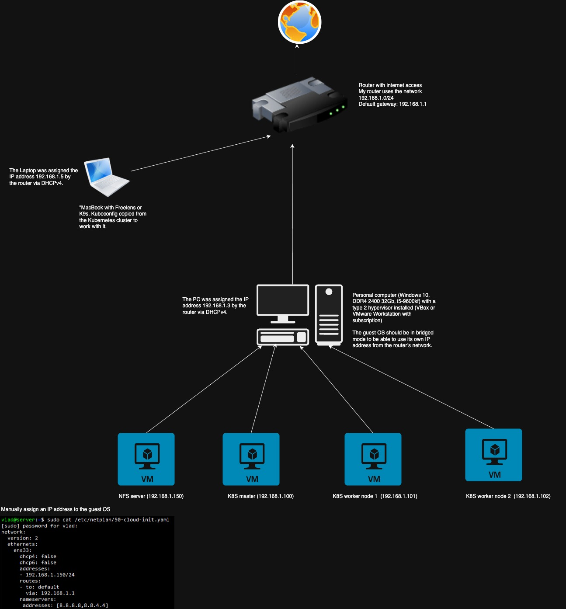

# On-prem K8S

## 🧭 Overview
This project provides a simple **on-premises Kubernetes (K8S)** setup that can be launched locally on a personal computer.  
The deployment includes a complete local Kubernetes cluster with:
- **1 Master Node**
- **2 Worker Nodes**
- **NFS Server** for shared storage

This setup is ideal for testing, learning, and developing Kubernetes workloads without relying on a cloud provider.

---

## ⚙️ Components
| Component     | Description |
|----------------|-------------|
| **Master Node** | Controls the cluster, manages API server, scheduler, and controller manager. |
| **Worker Nodes** | Run application workloads and connect to the master node. |
| **NFS Server** | Provides shared persistent storage for deployments. |

---

## 🚀 Deployment Plan

### 1. Prepare control environment (MacOS)
Install required tools:

- **Freelens** ([GitHub](https://github.com/freelensapp/freelens))
```bash
brew install --cask freelens
```
- Helm ([Helm](https://helm.sh/docs/intro/install/))
```bash
brew install helm
```
- Kubectl ([kubectl](https://kubernetes.io/docs/tasks/tools/install-kubectl-macos/))
```bash
brew install kubectl
```
2. **Prepare host environment for VM**
Use Ubuntu or Windows with installed VirtualBox. Launch VM with Ubuntu 24, network in bridged mode.

3. **Configure and initialize the Kubernetes Master Node**
   - Configure `kubeadm init` with the desired network settings.
   - Deploy the CNI plugin (e.g., Calico or Flannel).

4. **Configure and join Worker Nodes**
   - Use the `kubeadm join` command to connect each worker node to the cluster.

5. **Set up NFS Server (1 vCPU 1GB RAM)**
- Configure static IP
```bash
sudo nano /etc/netplan/50-cloud-init.yaml
```
```YAML
network:
  version: 2
  ethernets:
    enp0s3:
      dhcp4: false
      dhcp6: false
      addresses:
      - 192.168.1.150/24
      routes:
      - to: default
        via: 192.168.1.1
      nameservers:
        addresses: [8.8.8.8, 8.8.4.4]
```
```bash
sudo netplan apply
```
- Configure NFS server
```bash
sudo apt install nfs-kernel-server
sudo systemctl enable --now nfs-kernel-server
sudo mkdir -p /data
sudo chown nobody:nogroup /data
echo "/data *(rw,sync,no_subtree_check,no_root_squash)" | sudo tee /etc/exports
sudo exportfs -a
```

---
## 📦 Next Steps
Helm charts and values for:
- NFS storage class

---

## 🧰 Requirements Host 
- Virtualization support enabled
- Minimum recommended resources:
  - **CPU:** 6 cores  
  - **Memory:** 32 GB  
  - **Storage:** 200 GB free space
---


